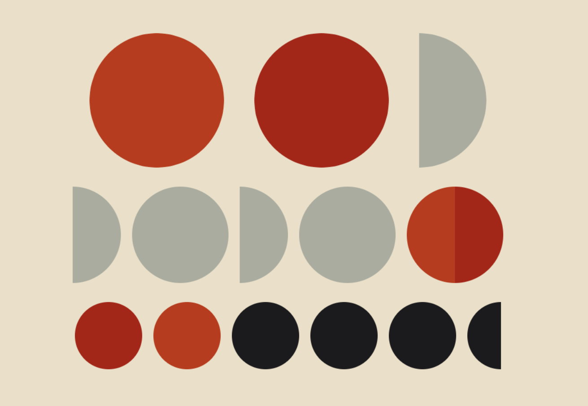

# Atividade de replicação de obra de arte

A seguir, apresento a obra "Circles and Half Circles" da artista Vera Molnár, criada em 1953. Esta obra é um exemplo marcante do uso de formas geométricas simples para criar composições visuais intrigantes, refletindo a exploração de Molnár com a arte generativa e computacional.

 
Circles and Half Circles. Vera Molnar, 1953 - Photo: Ville de Grenoble / Musée de Grenoble.
 

---

 
Tentativa de replicar a obra utilizando p5.js, Rayssa Guedes, 2026.
 

# Referências

Vera Molnár (1924–2023) foi uma artista multimídia húngara radicada em Paris, amplamente reconhecida como uma das principais pioneiras da arte computacional e generativa. Sua trajetória foi definida pela transição do desenho tradicional para o uso de algoritmos, sendo uma das *primeiras mulheres* a utilizar computadores na criação artística (que legal né?)

Embora ela tenha enfrentado rejeição inicial pelo público na época por usar máquinas na arte, Molnár influenciou gerações de artistas digitais. Recentemente, sua relevância foi reafirmada por exposições em instituições de prestígio como o Centre Pompidou e seu envolvimento em novos formatos, como a criação de coleções de NFTs no fim de sua vida.

Link: https://news.artnet.com/art-world/in-pictures-vera-molnar-pompidou-2446604

# Animação utilizada

Foi implementada uma animação simples, ao passar o mouse sobre as bolinhas e semielipses, elas aumentam levemente ;)
